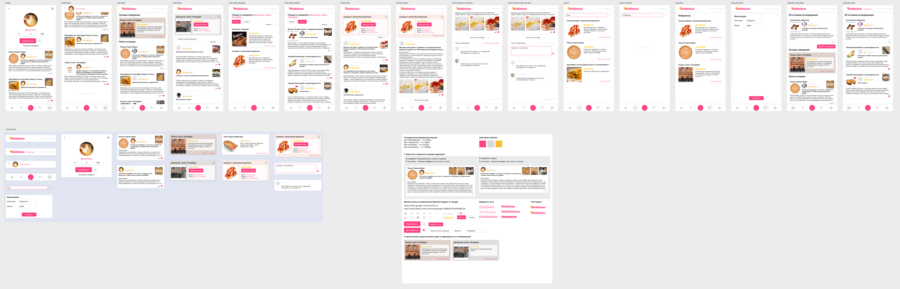

# Дизайн приложения DishDebate

Учебная работа в университет. Этот дизайн был разработан для концепта приложения **DishDebate**, которое позволяет пользователям делиться отзывами о блюдах и ресторанах.

## Описание

Приложение включает в себя следующие ключевые элементы:

- **Профиль пользователя**: Пользователи могут создавать и редактировать свои профили, добавлять фотографии и описания
- **Лента отзывов**: Главная страница отображает отзывы пользователей о различных блюдах и ресторанах, с возможностью оценивания и комментирования
- **Фильтры**: Пользователи могут фильтровать отзывы по различным критериям, таким как категория блюда или ресторан
- **Интерфейс взаимодействия**: Удобные кнопки для лайков и комментариев, а также возможность делиться отзывами в социальных сетях

## Содержимое

- Экраны приложения
- Библиотека компонентов

